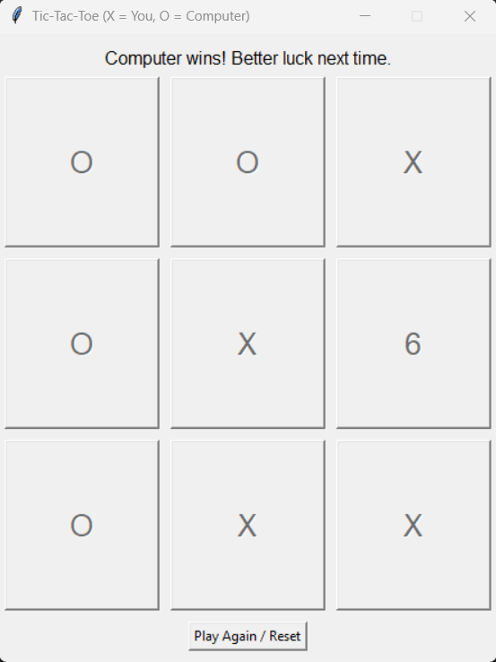

# Tic-Tac-Toe (GUI)

A simple desktop Tic-Tac-Toe game built with Python and Tkinter. You play as **X**, the computer plays as **O**.

## Features

- 3x3 clickable game board
- Play against a computer opponent that:
  - Takes a winning move when available
  - Blocks your winning move when it can
  - Prefers the center, then corners, then sides
- Win / lose / draw detection with a popup message
- "Play Again / Reset" button to start a new round

## How to run

Make sure you have Python 3 installed (Tkinter comes built in, no extra installs needed).

python3 tictactoe.py

## Screenshot

## Built with

- Python 3
- Tkinter (standard library)
